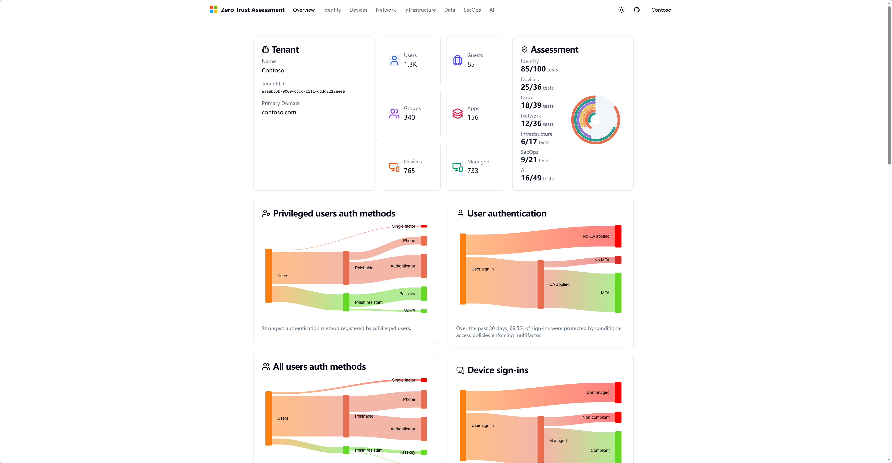

---
lab:
  title: 查看 Zero Trust Assessment 报告
  description: 在本练习中，您将打开 Microsoft Zero Trust Assessment 报告，并了解企业当前安全成熟度情况。
  duration: 10 分钟
  isexercise: true
---

# Exercise 1 - 查看 Zero Trust Assessment 报告

## 概述

在全面建设 Zero Trust 安全体系之前，企业首先需要了解当前环境的安全现状。

Microsoft Zero Trust Assessment 可以帮助组织评估当前安全成熟度，并从多个安全支柱（Security Pillars）的角度分析现有配置情况。

在本练习中，您将查看一个已经完成评估的企业租户报告，并了解 Assessment Dashboard 中的主要信息。

---

## 实验目标

完成本练习后，您将能够：

✅ 打开 Assessment Dashboard

✅ 查看租户基础信息

✅ 理解 Assessment Report 的整体结构

✅ 查看各安全支柱评分

✅ 为后续风险分析做好准备

---

## 打开 Assessment 报告

### Step 1

打开浏览器。

建议使用：

- Microsoft Edge
- Google Chrome

---

### Step 2

访问 Microsoft 官方演示环境：

[Zero Trust Assessment Demo](https://microsoft.github.io/zerotrustassessment/demo/#/)

> [!NOTE]
>
> 本实验采用微软官方演示租户数据。
>
> 后续企业实际部署时，可使用真实 Microsoft 365 租户运行 Assessment 并生成自己的评估报告。

---

### Step 3

等待 Dashboard 加载完成。

成功打开后，可以看到类似下图的信息：

```text
Tenant Name
Tenant ID
Users
Groups
Applications
Devices
```

> [!TIP]
>
> Dashboard 展示的是企业当前数字资产概览，可以帮助安全团队快速了解环境规模。




---

## 查看租户概况

### Tenant Overview

在页面顶部查看以下信息。

记录当前租户信息：

| 项目 | 结果 |
| -------- | -------- |
| Tenant Name | ____________________ |
| Users | ____________________ |
| Groups | ____________________ |
| Applications | ____________________ |
| Devices | ____________________ |

---

### 思考

企业拥有的用户、应用和设备越多，

安全治理会面临哪些挑战？

请记录您的想法：

________________________________________________

________________________________________________

---

## 查看 Assessment Summary

### 资源概览

---

### 观察结果

思考以下问题：

#### 问题 1

设备最多的类型是什么？

_________________________________

---

#### 问题 2

有哪些关键的点是安全要考虑到的？

_________________________________

---

#### 问题 3

如果您是企业安全负责人，

最需要优先改进哪个领域？

_________________________________

---

## 查看 Assessment 导航结构

Assessment 报告主要由多个安全支柱组成。

在左侧导航栏依次查看：

- Identity
- Devices
- Data
- Network
- Infrastructure
- Security Operations
- AI

---

### 思考

这些支柱分别对应企业哪些安全能力？

请尝试填写：

| 支柱 | 关注重点 |
|--------|--------|
| Identity | __________ |
| Devices | __________ |
| Data | __________ |
| Network | __________ |
| AI | __________ |

---

### 验证成功

如果您已完成以下操作，则本练习完成：

✅ 成功打开 Assessment Dashboard

✅ 成功查看 Tenant Overview

✅ 成功查看 Assessment Summary

✅ 成功记录各支柱评分

✅ 成功查看各安全支柱导航
---

### 完成实验

返回：

➡ [零信任评估（Zero Trust Assessment）](./01-Zero-Trust-Assessment.html)

---

## 小结

在本练习中，您了解了：

- 什么是 Zero Trust Assessment
- 企业安全成熟度评估报告结构
- Security Pillars 评分体系
- 企业当前安全状况概览

官方参考文件链接：[Get started with the Zero Trust Assessment](https://learn.microsoft.com/security/zero-trust/assessment/get-started)

---

### 后续实验

完成本实验后，请继续进行：

➡ [实验 02：风险报表分析（Risk Analysis）](../Lab02-RiskAnalysis/Lab02-RiskAnalysis.html)

在下一实验中，您将基于 Assessment 结果识别高风险问题，并制定安全改进计划。